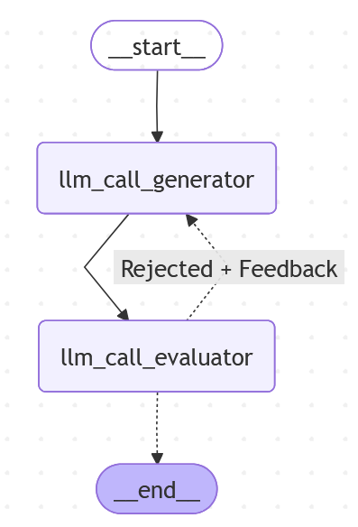

# Simple agent app

This repository contains a simple agent app created during the **Deep Learning with pytorch** course at [MIREA – Russian Technological University](https://www.mirea.ru/) (2024-2025 academic year).

This app generates joke on a given theme, judges whether it's fun or not, and generates a new one accodring to the feedback (if needed).

## 💡 Example

Make a request to generate a joke about cats:

```bash
curl http://127.0.0.1:8000/joke/cats
```

Sample response:

```json
{
    "response": "Why was the cat sitting on the computer? To keep an eye on the mouse!"
}
```

## 🧠 Agent Architecture

The agent uses a **refine-and-evaluate loop** implemented as a stateful graph using LangGraph:



## 📁 App structure

├── app/
│   ├── api/            # FastAPI endpoints
│   ├── models/         # LLM wrapper
│   ├── nodes/          # Graph node implementations
│   ├── states/         # State schema for the agent graph
│   └── workflows/      # LangGraph workflow definition
├── main.py             # Entry point for the FastAPI app
├── pyproject.toml      # Dependencies and project metadata
└── .env.example        # Environment variable template

## 🛠️ Technologies Used

| Category       | Libraries                                 |
|----------------|-------------------------------------------|
| Core           | Python 3.13                               |
| Agent          | `langgraph`, `langchain`                  |
| API            | `fastapi`, `uvicorn`                      |
| Typing         | `typing`, `typing_extensions`, `pydantic` |
| LLM            | GigaChat/GigaChat-2                       |

🔗 See [`pyproject.toml`](./pyproject.toml) for the complete dependency list.

## ⚙️ Configuration

Create a `.env` file in the project root based on the `.env.example` template and insert your GigaChat authorization key:

```env
GIGACHAT_AUTHORIZATION_KEY=<Insert your key here>
```

This key is used to authenticate requests to the GigaChat API. Make sure to add .env to your .gitignore file to prevent accidental exposure of your secret key.

To obtain a GIGACHAT_AUTHORIZATION_KEY, register at the [Sber Developer Portal](https://developers.sber.ru/)

## ▶️ How to Run

To run the notebooks locally, follow these steps:

1. Clone this repository:

   ```bash
   git clone https://github.com/MrDeryf/Simple-Agent-App
   cd Simple-Agent-App
   ```

2. Install dependencies using [Poetry](https://python-poetry.org/):

    ```bash
   poetry install
   ```

3. Set up your `.env` file:

    ```bash
    cp .env.example .env
    ```

    Then open `.env` and replace `<Insert your key here>` with your actual `GIGACHAT_AUTHORIZATION_KEY`

4. Start the development server:

    ```bash
    poetry run uvicorn main:app --reload
    ```

5. Make a request:

    ```http
    http://127.0.0.1:8000/joke/{topic}
    ```

    Replace `{topic}` with any subject (e.g., `cats`, `programming`, `winter`).
